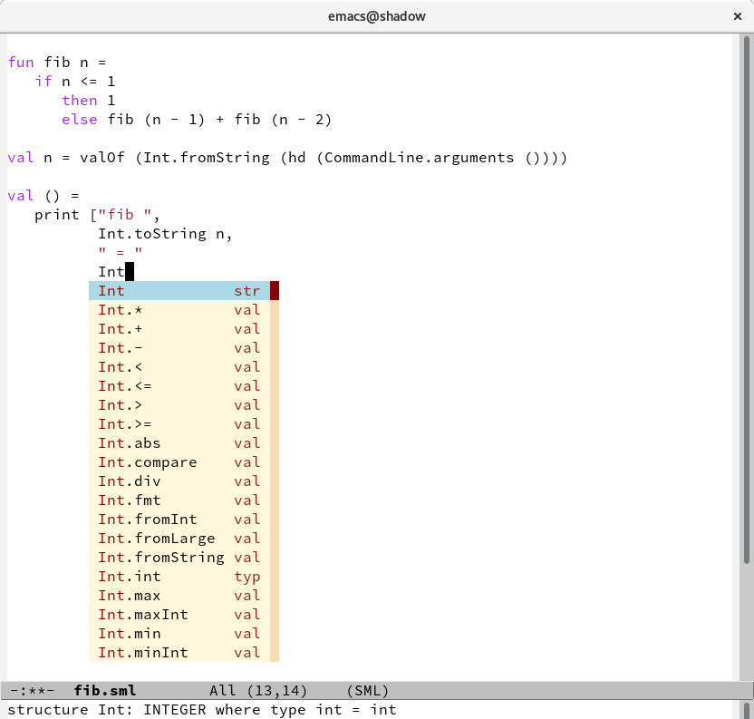

# company-mlton

[`company-mlton`](https://github.com/MatthewFluet/company-mlton) is a
[`company-mode`](http://company-mode.github.io/) completion back-end
for [MLton](http://mlton.org)/Standard ML.  It provides completion for
Standard ML keywords and for Standard ML (long) identifiers.
Candidate completion identifiers for the latter are loaded from a
basis file created by `mlton` using `-show-basis <file>` or
`(*#showBasis "<file>"*)`.  `company-mlton` ships with a default basis
file that corresponds to MLton's default environment (implicitly used
by `mlton` when compiling a `.sml` file).

## Screenshot



## Installation

### Dependencies

 * Emacs packages
   * [`company-mode`](http://company-mode.github.io/) &ge; 0.9.4 (required; install via [GNU Elpa](http://elpa.gnu.org/) or [MELPA](https://melpa.org))
   * [`dash`](https://github.com/magnars/dash.el) &ge; 2.12.0 (required; install via [GNU Elpa](http://elpa.gnu.org/) or [MELPA](https://melpa.org))
   * [`sml-mode`](https://elpa.gnu.org/packages/sml-mode.html) (recommended; install via [GNU Elpa](http://elpa.gnu.org/))
 * [MLton](https://github.org/MLton/mlton) &ge; 20171229.155218-ga5d65b8 (recommended, to generate custom basis files)

<!-- ### Install via [MELPA](https://melpa.org/) -->

### Install via Git

Clone repository:
``` shell
cd ~/.emacs.d
git clone https://github.com/MatthewFluet/company-mlton
```

Add to `.emacs` or `init.el`:
``` emacs-lisp
(add-to-list 'load-path "~/.emacs.d/company-mlton")
(require 'company-mlton)
(add-hook 'sml-mode-hook #'company-mlton-init)
```
